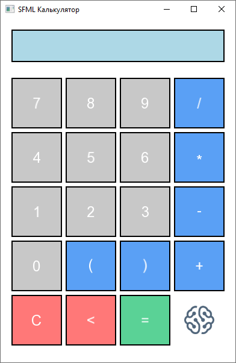

<p align="center">
  
</p>

<h1 align="center">SFML Calc — Калькулятор на C++ и SFML</h1>

> Простой калькулятор с графическим интерфейсом, созданный с использованием библиотеки SFML. Программа позволяет выполнять базовые математические операции и имеет удобный пользовательский интерфейс.

<p align="center">
  
</p>

## 🚀 О проекте

**SFML Calc** — калькулятор с графическим интерфейсом, реализованный на языке программирования C++ с использованием мультимедийной библиотеки SFML. Данное приложение позволяет выполнять базовые математические операции и позволяет продемонстрировать современные возможности выбранного языка программирования.

### Архитектура

Приложение-калькулятор представляет собой графическое приложение, построенное по принципу модульности. Архитектура включает следующие основные компоненты:

-	Графический интерфейс – отвечает за отображение элементов управления и результатов
-	Логический модуль – обрабатывает математические операции
-	Система ввода – управляет пользовательским взаимодействием

Функциональные составные части кнопочной панели:

-	Цифровые кнопки
-	Кнопки математических операций (деление, умножение, вычитание, сложение)
-	Кнопки скобок
-	Специальные кнопки (сброс и удаления последнего символа)
-	Кнопка подсчета результата

### Логика работы

В структуре калькулятора находятся три ключевых класса:

1. Calculator – главный класс, собирающий интерфейс, обрабатывающий ввод пользователя и обеспечивающий связь с вычислениями.
2. ExpressionEvaluator – рекурсивный парсер выражений с выполнением вычислений.
3. Button – класс для кнопок.

## ✨ Основные возможности

В базовые возможности программы входят уже реализованные и готовые к использованию функции:

- **Арифметические операции:** сложение, вычитание, умножение, деление.
- **Работа со скобками:** поддержка вложенных выражений.
- **Управление:** клавиатура, мышь.
- **Дополнительные функции:** очистка ввода, удаление последнего символа, вычисление результата.

## 🛠️ Технологии

SFML Calc использует следующий технологический стек и инструменты для разработки:

| Категория | Технологии                                           |
| --------- | -----------------------------------------------------|
| **Язык**  | C++ 20                                               |
| **IDE**   | [Visual Studio Code](https://code.visualstudio.com/) |
| **UI**    | [SFML](http://www.sfml-dev.org)                      |

## 🏁 Начало работы

Чтобы создать и запустить локальную копию, выполните следующие простые шаги.

### Разработка

Убедитесь, что [Visual Studio Code](https://code.visualstudio.com/), [расширение C/C++ от Microsoft](https://marketplace.visualstudio.com/items?itemName=ms-vscode.cpptools), [MSYS2](https://www.msys2.org/) и [SFML](http://www.sfml-dev.org) установлены.

### Сборка

```
    g++.exe -g src/main.cpp -o build/sfml-calc -lsfml-graphics -lsfml-window -lsfml-system -std=c++20 -mwindows
```

## 🏋️‍♀️ Автор

Денис Игнатьев (разработка, тестирование)